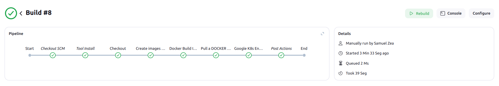
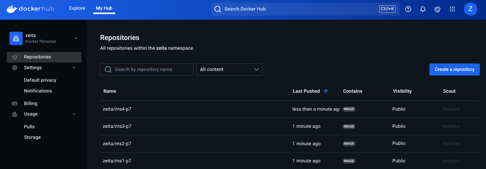

# **Práctica 7**

## **Comandos y configuraciones**

En esta práctica se hace la creación de un cluster de kubernetes mediante la herramienta KOps (Kubernetes Operations), por lo que a continuación se describen los pasos necesarios para su correcta instalación y creación:

- **Instalaciones**

    Debemos asegurarnos que tenemos instaladas las siguientes herramientas:

    - `kops`
    - `kubectl`
    - `gcloud` (CLI de Google Cloud)
    - Habilitar la API de Compute Engine en nuestro proyecto de GCP
    - Asegurarnos que tenemos un proyecto de GCP.

- **Autenticacion GCP**

    Si no estamos autenticados en google cloud es necesario que nos autentiquemos con:

    ```sh
    gcloud init
    ```

- **Configuración de bucket en Google Cloud Storage**

    Es necesario que configuremos un bucket en GCP el cual sera usado como el `KOPS_STATE_STORE`, y para hacerlo, utilizamos el siguiente comando:

    ```sh
    gsutil mb -p <PROJECT_ID> gs://<YOUR-KOPS-BUCKET>
    ```

    Y posteriormente exportamos una variable de entorno para utilizar este bucket

    ```sh
    $env:KOPS_STATE_STORE = "gs://kops-state-store-demo"
    ```

- **Habilitación de APIs en GCP**

    Para habilitar las APIs ingresamos el siguiente comando:

    ```sh
    gcloud services enable compute.googleapis.com
    ```

    ### **Creación del cluster**

    Una vez tengamos todo lo anteriormente mencionado y realizado, podremos crear nuestro cluster utilizando el siguiente comando:

    ```sh
    kops create cluster --name=cluster-p7.k8s.local --cloud=gce --zones=us-central1-a --project=proyecto-sa-455021 --node-count=1 --node-size=n1-standard-2 --control-plane-size=n1-standard-2 --state=$env:KOPS_STATE_STORE
    ```

    ### **Instalación de Jenkins**

    Para poder instalar jenkins es necesario realizarlo mediante la pagina oficial para neustro sistema operativo, en este caso se explican los comandos para Debian|Ubuntu y Linux Mint:

    **Long Term Support Release**

    ```sh
    sudo wget -O /usr/share/keyrings/jenkins-keyring.asc \
  https://pkg.jenkins.io/debian-stable/jenkins.io-2023.key
    echo "deb [signed-by=/usr/share/keyrings/jenkins-keyring.asc]" \
  https://pkg.jenkins.io/debian-stable binary/ | sudo tee \
  /etc/apt/sources.list.d/jenkins.list > /dev/null
    sudo apt-get update
    sudo apt-get install jenkins
    ```

    **Instalación de Java**

    ```sh
    sudo apt update
    sudo apt install fontconfig openjdk-17-jre
    java -version
    ```

    Y deberíamos ver una salida asi:

    ```sh
    openjdk version "17.0.13" 2024-10-15
    OpenJDK Runtime Environment (build 17.0.13+11-Debian-2)
    OpenJDK 64-Bit Server VM (build 17.0.13+11-Debian-2, mixed mode, sharing)
    ```

    ### **Iniciar Jenkins**

    Y una vez hayamos instalado y comprobado todo, podremos iniciar jenkins e ingresar a `localhost:8080`, y si accedemos podremos configurar nuestro Jenkins.

    **Activamos el servicio con:**

    ```sh
    sudo systemctl enable jenkins
    ```

    **Iniciamos Jenkins**
    
    ```sh
    sudo systemctl start jenkins
    ```

## **Archivo Jenkins**
- ### [Jenkins](./Jenkinsfile)

## **Flujo de Jenkins**



## **Registry Docker Hub**



## **Archivos YAML**

- #### [Microservicio 1](./k8s/microservice_1.yaml)
- #### [Microservicio 2](./k8s/microservice_2.yaml)
- #### [Microservicio 3](./k8s/microservice_3.yaml)
- #### [Microservicio 4](./k8s/microservice_4.yaml)
- #### [Script Cronjob](./k8s/cronjob.yaml)
- #### [Namespace](./k8s/namespace.yaml)
- #### [Ingress](./k8s/ingress.yaml)